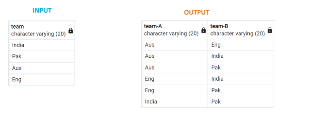

#### Interview Question

#### Q1: What is order of execution in sql?

FROM > WHERE > GROUP BY > HAVING > SELECT > ORDER BY > LIMIT

```
Order           clause                  function
1                From                Choose and Join Tables to get data.
2                where               filters the base data.
3                Group by            Aggregate the base Data.
4                having              Filter the aggregated  Data.
5                Select              Returns the final Data.
6                Order by            Sorts the final data.
7                linit               Limits the returned data to a row count.
````

***Example:***
```
SELECT category, AVG(sales) AS avg_sales
FROM SalesData
WHERE year > 2020
GROUP BY category
HAVING COUNT(*) > 10
ORDER BY avg_sales DESC
LIMIT 3
```

### Q2: Find monthly sales and sort it by desc order

****Solution PostgreSQL:****

```
SELECT extract(year from Order_date) as years, to_char(Order_date,'Mon') as months,
sum(Sales) as TotalSales
FROM Products
GROUP BY 1,2
ORDER BY TotalSales DESC
```
```Solution MySql:

SELECT YEAR(Order_date) AS Years, MONTH(Order_date) AS Months, SUM(Sales) AS TotalSales
FROM Products
GROUP BY YEAR(Order_date),MONTH(Order_date)
ORDER BY TotalSales DESC;
```


### Q3: Find the candidates best suited for an open Data Science job. Find candidates who are proficient in Python, SQL, and Power BI.
```
Write a query to list the candidates who possess all of the required skills for the job. Sort the output by candidate ID in ascending order. ```

``` 
Ans: will solve in 3 steps
1. Filter data for 3 skills (Python, SQL, and Tableau) using IN operator
2. Find count of skills for each group using the COUNT function and group students using GROUP BY clause
3. Finally filter the data having count = 3 and sort the output by student id

- Query:

```
CREATE TABLE Applications (
candidate_id int,
skills varchar);

INSERT INTO Applications(candidate_id,skills)
VALUES
(101, 'Power BI'), (101, 'Python'), (101, 'SQL'), (102, 'Tableau'), (102, 'SQL'),
(108, 'Python'), (108, 'SQL'), (108, 'Power BI'), (104, 'Python'), (104, 'Excel')
```

```
select candidate_id, count(skills) as skill_count
from Applications
where skills IN ('Python', 'SQL', 'Power BI')
group by candidate_id
having count(skills) = 3
order by candidate_id
```

4. List all the matches between teams, if matches are played once

```
CREATE TABLE match ( team varchar(20) )
INSERT INTO match (team) VALUES ('India'), ('Pak'), ('Aus'), ('Eng')
```

5. List all the matches between teams, if matches are played once Permutation & Combination:

```
n! = n*(n-1)*..... 3*2*1 
nCr = n!/(n-r)!r!

Permutation & combination:
4 teams – 6 matches
Substituting four and two into the formula, n=4 and r=2, the result is, 
4C2= 4!/[2!(4-2)!]
= 4!/(2!2!)
=(4*3*2*1)/(2*1*2*1)
=6
```
```
WITH CTE AS ( SELECT *, ROW_NUMBER() OVER(ORDER BY team ASC)
AS id FROM match )
SELECT a.team as “team-A”, b.team as “team-B”
FROM CTE as a
join CTE as b ON a.team <> b.team
WHERE a.id < b.id
```
6. Find the list of employees whose salary ranges between 2L to 3L
```
ELECT EmpName, Salary FROM Employee
WHERE Salary > 200000 AND Salary < 300000
--- OR –--
SELECT EmpName, Salary FROM Employee
WHERE Salary BETWEEN 200000 AND 300000
```
7. Write a query to retrieve the list of employees from the same city.
```
SELECT E1.EmpID, E1.EmpName, E1.City FROM Employee E1, Employee E2
WHERE E1.City = E2.City AND E1.EmpID != E2.EmpID;
```
8. Find the list of employees whose salary ranges between 2L to 3L.
``` 
SELECT EmpName, Salary FROM Employee WHERE Salary > 200000 AND Salary < 300000
                  --- OR –--
SELECT EmpName, Salary FROM Employee WHERE Salary BETWEEN 200000 AND 300000 
```
9. find the null values in the Employee table. 
```
SELECT * FROM Employee WHERE EmpID IS NULL
```
10. What’s the male and female employees ratio.
```
SELECT (COUNT(*) FILTER (WHERE Gender = 'M') * 100.0 / COUNT(*)) AS MalePc, (COUNT(*) FILTER (WHERE Gender = 'F') * 100.0 / COUNT(*)) AS FemalePc FROM Employee;
```
11. Query to find the cumulative sum of employee’s salary.
```
SELECT EmpID, Salary, SUM(Salary) OVER (ORDER BY EmpID) AS CumulativeSum FROM Employee;
```
12. Write a query to fetch 50% records from the Employee table.
``` 
SELECT * FROM Employee WHERE EmpID <= (SELECT COUNT(EmpID)/2 from Employee)
```
If EmpID is not auto-increment field or numeric, then we can use Row NUMBER function

13.  fetch the employee’s salary but replace the LAST 2 digits with ‘XX’  i.e 12345 will be 123XX .
```
SELECT Salary, CONCAT(SUBSTRING(Salary::text, 1, LENGTH(Salary::text)-2), 'XX') as masked_number
FROM Employee
                     OR
SELECT Salary, CONCAT(LEFT(CAST(Salary AS text), LENGTH(CAST(Salary AS text))-2), 'XX') 
AS masked_number FROM Employee
                      and
-- MySQL
SELECT Salary,  CONCAT(LEFT(Salary, LEN(Salary)-2), 'XX') as masked_salary FROM Employee;
```
14. Write a query to fetch even and odd rows from Employee table

```
---Fetch even rows
SELECT * FROM 
(SELECT *, ROW_NUMBER() OVER(ORDER BY EmpId) AS 
RowNumber
FROM Employee) AS Emp
WHERE Emp.RowNumber % 2 = 0
---Fetch odd rows
SELECT * FROM 
(SELECT *, ROW_NUMBER() OVER(ORDER BY EmpId) AS 
RowNumber
FROM Employee) AS Emp
WHERE Emp.RowNumber % 2 = 1

/*If you have an auto-increment field 
like EmpID then we can use the  MOD() function:
*/
---Fetch even rows
SELECT * FROM Employee 
WHERE MOD(EmpID,2)=0;
---Fetch odd rows
SELECT * FROM Employee 
WHERE MOD(EmpID,2)=1;
```
15. : Write a query to find all the Employee names whose name:
```
• Begin with ‘A’
• Contains ‘A’ alphabet at second place
• Contains ‘Y’ alphabet at second last place
• Ends with ‘L’ and contains 4 alphabets 
• Begins with ‘V’ and ends with ‘A’
```
```
SELECT * FROM Employee WHERE EmpName LIKE 'A%';
SELECT * FROM Employee WHERE EmpName LIKE '_a%';
SELECT * FROM Employee WHERE EmpName LIKE '%y_';
SELECT * FROM Employee WHERE EmpName LIKE '____l';
SELECT * FROM Employee WHERE EmpName LIKE 'V%a
```

16. Write a query to find the list of Employee names which is:
```
• starting with vowels (a, e, i, o, or u), without duplicates
• ending with vowels (a, e, i, o, or u), without duplicates
• starting & ending with vowels (a, e, i, o, or u), without duplicates
```
```
SELECT DISTINCT EmpName FROM Employee 
WHERE LOWER(EmpName) SIMILAR TO '[aeiou]%'

SELECT DISTINCT EmpName FROM Employee
WHERE LOWER(EmpName) SIMILAR TO '%[aeiou]' 

SELECT DISTINCT EmpName FROM Employee
WHERE LOWER(EmpName) SIMILAR TO '[aeiou]%[aeiou]'
```
***MYSQL***
```
SELECT DISTINCT EmpName FROM Employee WHERE LOWER(EmpName) REGEXP '^[aeiou]' 

SELECT DISTINCT EmpName FROM Employee WHERE LOWER(EmpName) REGEXP '[aeiou]$' 

SELECT DISTINCT EmpName FROM Employee
WHERE LOWER(EmpName) REGEXP  '^[aeiou].*[aeiou]$'
```
17. Find Nth highest salary from employee table with and without using the TOP/LIMIT keywords.
```
 -- Using LIMIT
SELECT Salary FROM Employee   ORDER BY Salary DESC  LIMIT 1 OFFSET N-1

----- without using TOP/LIMIT  -----
SELECT Salary FROM Employee E1 WHERE N-1 = (
SELECT COUNT( DISTINCT ( E2.Salary ) ) FROM Employee E2 WHERE E2.Salary > E1.Salary );

--- OR ---

SELECT Salary FROM Employee E1 WHERE N = (
SELECT COUNT( DISTINCT ( E2.Salary ) )
FROM Employee E2 WHERE E2.Salary >= E1.Salary );

 ---- USING Top ----
 SELECT TOP 1 Salary  FROM Employee
WHERE Salary < ( SELECT MAX(Salary) FROM Employee)
AND Salary NOT IN ( SELECT TOP 2 Salary
FROM Employee ORDER BY Salary DESC)
ORDER BY Salary DESC;
```

18. Write a query to find and remove duplicate records from a table.
```
SELECT EmpID, EmpName, gender, Salary, city, 
COUNT(*) AS duplicate_count
FROM Employee
GROUP BY EmpID, EmpName, gender, Salary, city
HAVING COUNT(*) > 1;

         --------------OR-------
DELETE FROM Employee WHERE EmpID IN  (SELECT EmpID FROM Employee
GROUP BY EmpID HAVING COUNT(*) > 1);
```
11. retrieve the list of employees working in same project.
```
WITH CTE AS 
(SELECT e.EmpID, e.EmpName, ed.Project FROM Employee AS e
INNER JOIN EmployeeDetail AS ed  ON e.EmpID = ed.EmpID)
SELECT c1.EmpName, c2.EmpName, c1.project  FROM CTE c1, CTE c2
WHERE c1.Project = c2.Project AND c1.EmpID != c2.EmpID AND c1.EmpID < c2.EmpID
```
19. Show the employee with the highest salary for each project

```
ELECT ed.Project, MAX(e.Salary) AS ProjectSal
FROM Employee AS e INNER JOIN EmployeeDetail AS ed
ON e.EmpID = ed.EmpID GROUP BY Project
ORDER BY ProjectSal DESC;
---
Similarly we can find Total Salary for each 
project, just use SUM() instead of MAX()
---

Alternative, more dynamic solution: here you can fetch EmpName, 2nd/3rd highest value, etc

WITH CTE AS 
(SELECT project, EmpName, salary,
ROW_NUMBER() OVER (PARTITION BY project ORDER BY salary DESC) AS row_rank FROM Employee AS e
INNER JOIN EmployeeDetail AS ed 
ON e.EmpID = ed.EmpID) SELECT project, EmpName, salary
FROM CTE WHERE row_rank = 1;
```
20. find the total count of employees joined each year
```
SELECT EXTRACT('year' FROM doj) AS JoinYear, COUNT(*) AS EmpCount
FROM Employee AS e
INNER JOIN EmployeeDetail AS ed ON e.EmpID = ed.EmpID
GROUP BY JoinYear
ORDER BY JoinYear ASC
```
21. Create 3 groups based on salary col, salary less than 1L is low, between 1 -2L is medium and above 2L is High
```
SELECT EmpName, Salary, CASE
WHEN Salary > 200000 THEN 'High'
WHEN Salary >= 100000 AND Salary <= 200000 THEN 'Medium'
ELSE 'Low' END AS SalaryStatus
FROM Employe
```
22. BONUS: Query to pivot the data in the Employee table and retrieve the total 
salary for each city. 
The result should display the EmpID, EmpName, and separate columns for each city 
(Mathura, Pune, Delhi), containing the corresponding total salary.

```
SELECT EmpID, EmpName,
SUM(CASE WHEN City = 'Mathura' THEN Salary END) AS "Mathura",
SUM(CASE WHEN City = 'Pune' THEN Salary END) AS "Pune",
SUM(CASE WHEN City = 'Delhi' THEN Salary END) AS "Delhi"
FROM Employee GROUP BY EmpID, EmpName;
```

#### assignment

1. If we divide 0 with a NULL, what will be the error/output
 ```
 A) 0 B) NULL C) Division Error D) Query will not execute
```
2. If we divide a NULL with 1 (or any number), what will be the error/output
```
A) 0 B) NULL C) Division Error D) Query will not execute
```
3. If we divide a NULL with NULL, what will be the error/output
```
A) 0 B) NULL C) Division Error D) Query will not execute
```
4. If we divide any 0 with any number, what will be the error/
output
```
A) 0 B) NULL C) Division Error D) Query will not execute
```
5. If we divide 0 with 0 (or any number), what will be the error/
```output
A) 0 B) NULL C) Division Error D) Query will not execute
```
#### ***NOTE:*** Perform any operation (sum, subtract, div, multiply) with NULL value, output will be NULL


6. WHERE FirstName LIKE 'A%’ . Which names does this query return? Select all that are applicable.
```
A) ARJUN B) TARA C) BHEEM D) ABHIMANYU
```
7. WHERE FirstName LIKE ’_R%’ . Which names does this query return? Select all that are applicable.
```
A) AR B) KRISHNA C) ARJUN D) ROHINI
```
8. WHERE FirstName LIKE ’%D%’ . Which names does this query return? Select all that are applicable.
```
A) NAKUL B) MADHAV C) SUNDAR D) MOON
```
9. WHERE FirstName LIKE ’M%N’ . Which names does this query return? Select all that are applicable.

```
A) MADHAV B) MADAN C) MOHAN D) NEON
```
10. WHERE FirstName LIKE ’M_ _ _%’ . Which names does this query return? Select all that are applicable.
```
A) MAN B) GOPAL C) MAANSI D) HARI
```

11. From the given WHERE clauses, which will return only rows that have a NULL in a column?
```
A) WHERE column_name <> NULL B) WHERE column_name IS NULL
C) WHERE column_name = NULL D) WHERE column_name NOT IN (*)
```
12. From the given WHERE clauses, which will return only rows that have a NOT NULL in a column?
```
A) WHERE column_name <> NULL B) WHERE column_name IS NULL
C) WHERE column_name = NULL D) WHERE column_name != NULL
```
13. Use of limit and offset in sql together in a sql query. Select all that are applicable.
```
A) SELECT * FROM artists LIMIT 5 OFFSET 2; B) SELECT * FROM artists 5, OFFSET 2;
C) SELECT * FROM artists LIMIT 5 , 2; D) SELECT * FROM artists 2, 5;
```
14. Which of the update queries listed below is/are valid?
```
A) UPDATE Supplier SET city=‘Pune’ AND Phone=’9123456’ AND Fax=’044-54321’
```
B) UPDATE Supplier SET city=’Pune’, Phone=’9123456’, Fax=’044-54321’

#### Theory Questions
1. What is SQL?
```
SQL (Structured Query Language) is a 
programming language used to interact 
with database
```
2. What are the subsets of SQL or types of SQL commands and briefly explain?
3. What is the sequence of execution in SQL?
4. Advantages & disadvantage of SQL
5. What is Database? And how to create a database in SQL?
6. What is DBMS?
7. What are Tables and Fields?
8. What are Constraints in SQL?
9. What is a primary key and foreign key?
10.How to create and delete a table in SQL?
11.What is a "TRIGGER" in SQL?

Rishabh Mishra

12. How to change a table name in SQL?
13. What is join in SQL? List its different types.
14. What is Normalization in SQL?
15. How to insert a date in SQL?
16. What are the TRUNCATE, DELETE and DROP statements?
17. What are the different types of SQL operators?
18. What are Aggregate and Scalar functions?
19. What does a window function do in SQL?
20. What are operators, share it’s types and examples
21. Difference between rank, dense_rank and row_number in sql
22. What are clustered and non-clustered index in SQL?