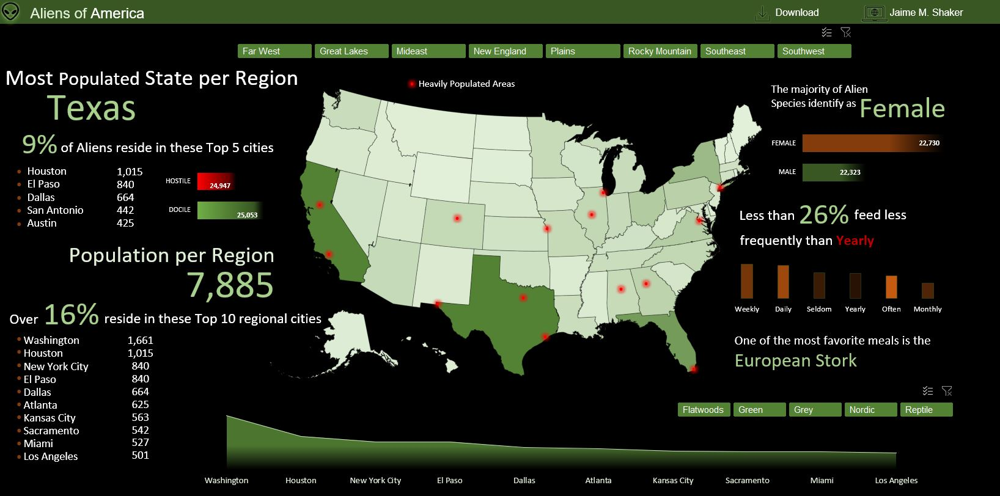
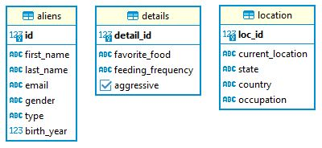

# Aliens of America

## Introduction
A portfolio building dataset provided by [Subham kumar](https://www.linkedin.com/in/ksubham/) on LinkedIn

Check out [My Current Analysis](./ANALYSIS.md"My Current Analysis") in SQL.

Check out [My Current Excel Dashboard](./excel_dashboard/aliens_of_america.xlsx "My Current Excel Dashboard").

## Problem Statement
For this project, you play a role as a newly hired Data Analyst for a pharmaceutical company.

It's the year 2022 and aliens are well known to be living amongst us.

Unfortunately, some of the aliens are a bit... too alien... and would like to fit into society a bit more.

So it's up to you to find the best state(s) we should market our new prescription.

It would be helpful to know...

- If these aliens are hostile
- Their diet
- Their age
- It's up to you to clean up the data and report back.

## Datasets used
This dataset contains only three tables named 
 - aliens
 - details
 - location

## Entity Relationship Diagram

